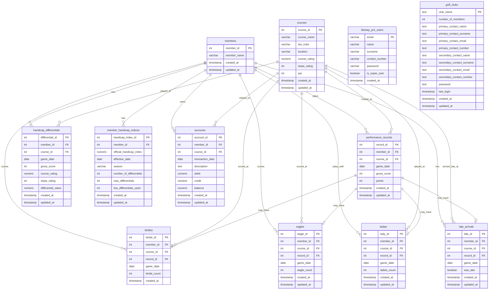

# MyGolf Database Schema

## Entity Relationship Diagram

## Table Descriptions

### Core Tables

#### **members**
Primary table containing all golf club members.
- **Purpose**: Central registry of all members
- **Key Fields**: member_id (PK), member_name
- **Relationships**: Referenced by all activity tables

#### **courses**
Golf courses where games are played.
- **Purpose**: Store course details and ratings
- **Key Fields**: course_id (PK), course_name, course_rating, slope_rating, par
- **Relationships**: Referenced by performance and activity tables

#### **performance_records**
Main game performance data for each member.
- **Purpose**: Track scores and points for each game
- **Key Fields**: record_id (PK), member_id (FK), course_id (FK), game_date, gross_score, points
- **Relationships**: Parent to birdies, eagles, ladies, and late_arrivals

### Handicap Management Tables

#### **handicap_differentials**
Calculated handicap differentials for each game.
- **Purpose**: Store individual game differentials for handicap calculation
- **Key Fields**: differential_id (PK), member_id (FK), differential_value
- **Used For**: Calculating official handicap indices

#### **member_handicap_indices**
Official handicap index history for members.
- **Purpose**: Track handicap index changes over time
- **Key Fields**: handicap_index_id (PK), member_id (FK), official_handicap_index, effective_date

### Activity Tracking Tables

#### **birdies**
Tracks birdies scored by members.
- **Purpose**: Record birdie achievements
- **Key Fields**: birdie_id (PK), member_id (FK), record_id (FK), birdie_count
- **Linked To**: performance_records

#### **eagles**
Tracks eagles scored by members.
- **Purpose**: Record eagle achievements (rare, exceptional scores)
- **Key Fields**: eagle_id (PK), member_id (FK), record_id (FK), eagle_count
- **Linked To**: performance_records

#### **ladies**
Tracks when members play with ladies.
- **Purpose**: Record social golf events with female players
- **Key Fields**: lady_id (PK), member_id (FK), record_id (FK), ladies_count
- **Linked To**: performance_records

#### **late_arrivals**
Tracks member punctuality.
- **Purpose**: Record late arrivals to tee times
- **Key Fields**: late_id (PK), member_id (FK), record_id (FK), was_late
- **Linked To**: performance_records

### Financial Table

#### **accounts**
Financial transactions for each member.
- **Purpose**: Track debits, credits, and running balance
- **Key Fields**: account_id (PK), member_id (FK), transaction_date, debit, credit, balance
- **Use Cases**: Game fees, payments, membership dues

### Leaderboard Views (Read-only)

#### **birdies_leaderboard**
Aggregated birdie statistics by member.
- **Fields**: member_id, total_birdies, total_games_with_birdies, avg_birdies_per_game

#### **eagles_leaderboard**
Aggregated eagle statistics by member.
- **Fields**: member_id, rank, total_eagles, games_with_eagles, avg_eagles_per_game

#### **ladies_leaderboard**
Aggregated ladies game statistics.
- **Fields**: member_id, total_ladies, games_with_ladies, avg_ladies_per_game, rank

#### **late_arrivals_leaderboard**
Aggregated late arrival statistics.
- **Fields**: member_id, total_late_arrivals, courses_late_at, rank

#### **birdies_statistics**
Detailed birdie performance statistics.
- **Fields**: birdie_id, member_id, course_id, record_id, birdies_count, points_scored

### User Management Tables

#### **mygolf_users**
System users (administrators/app users).
- **Purpose**: Authentication and user management
- **Key Fields**: email (PK), name, surname, password, is_super_user
- **RLS**: Enabled (users can only read their own data)

#### **golf_clubs**
Golf club organizations.
- **Purpose**: Multi-club management
- **Key Fields**: club_name (PK), number_of_members, contact information
- **RLS**: Enabled (authenticated users can do all operations)

## Key Relationships

### Central Hub: performance_records
The `performance_records` table serves as the central hub connecting:
- Member's game scores
- Course information
- Activity achievements (birdies, eagles, ladies, late arrivals)

### Data Flow
1. **Member plays a game** → Creates `performance_records` entry
2. **Achievements during game** → Creates linked entries in `birdies`, `eagles`, `ladies`
3. **Handicap calculation** → Uses `performance_records` to create `handicap_differentials`
4. **Official handicap** → Stored in `member_handicap_indices`
5. **Financial transactions** → Recorded in `accounts`

### Foreign Key Constraints
- All activity tables reference `members` (ON DELETE CASCADE)
- All activity tables reference `courses` (ON DELETE SET NULL)
- Activity tables may reference `performance_records` via `record_id`

## Indexes
Performance optimization indexes exist on:
- `member_id` in all member-related tables
- `course_id` in all course-related tables
- `game_date` / `transaction_date` for date-based queries
- `record_id` for linking activities to games

## Notes
- All tables include `created_at` and `updated_at` timestamps for audit trails
- Leaderboard views are likely materialized views or views for reporting
- RLS (Row Level Security) is only enabled on user management tables
